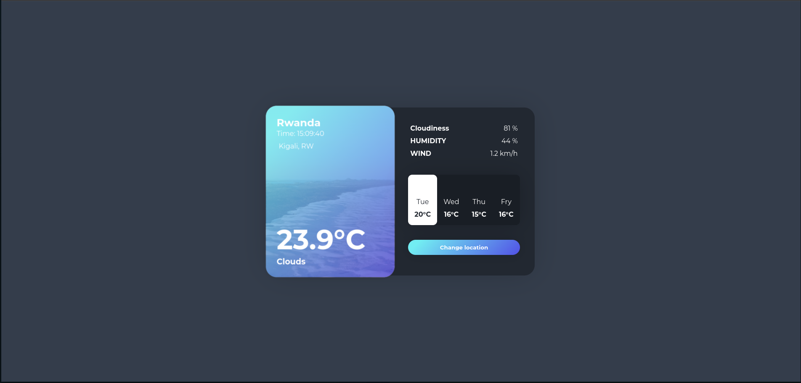

# Kay's Weather Application 

This is a simple one-page application that tracks the user's location, gets the user's location city and will send back weather information about that city. 

the application uses two APIs 
1 - Location API that comes from [IP geolocation API](https://app.abstractapi.com/). You need to sign up to get an api key that you will use in the application. 
2 - Open the weather API that comes from [Open weather api](https://openweathermap.org/api). You must sign up and create a new api key that you will use for the application. 

### using the api Key 
To use the apis in the application, you will need to create a `.env` file and add the api keys 
in this format 

`location_api_key = eXXXXXXXXXXXXXXXXX`

`open_weather_api = fbXXXXXXXXXXXXXXXX`

make sure the use the api keys from the websites.

# running the application 
In order to run this application,

# Clone the project 

`git clone https://github.com/kaybrian/Wather_forcast_app.git`

# create a virtual environment(env)
To create a virtual env in python 

`python -m venv env`

# activate the env 

`source env/bin/activate`

# install the requirements

`pip install -r requirements.txt`

# add the .env file with the api keys 
the file should only have two api keys 

`open_weather_api = fbXXXXXXXXXXXXXXXX`

like i said , you can get those api keys from Open weather website and IP websites 

# Migrate 
Run a migrations in Django 

`python manage.py make migrations`

# run the server 
`python manage.py runserver` 

when you run the server, the application will run on localhost  `port:8000`

`http://127.0.0.1:8000/`

The home page of the application will look like this. Remember all this information is coming from a users location 

    
